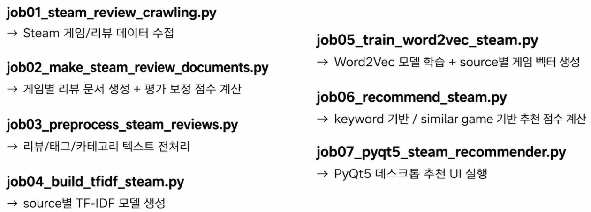
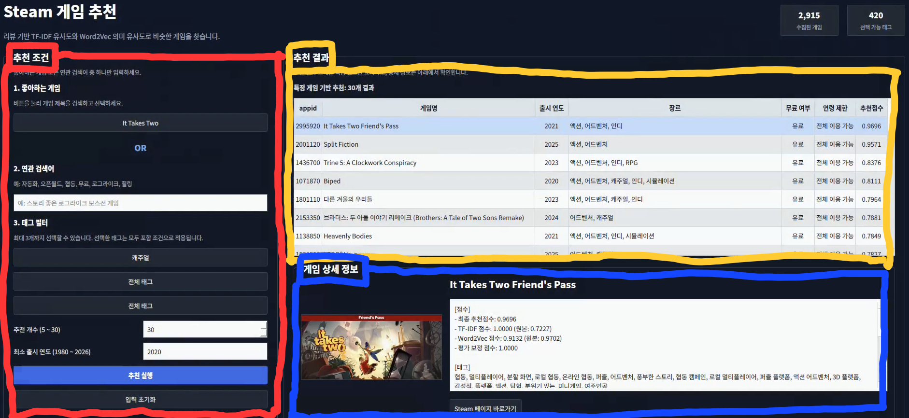

# 🎮 Steam Game Recommendation

<br>

## 📌 1. Project Summary (프로젝트 요약)

Steam Game Recommendation은 Steam에서 한국어를 지원하는 게임과 한국어 사용자 리뷰를 수집한 뒤, 사용자가 입력한 게임명 또는 연관 검색어를 바탕으로 유사한 게임을 추천하는 게임 추천 시스템입니다.

<br>

## ✨ 2. Key Features (주요 기능)

### 2.1 Steam Korean Review Crawling (Steam 한국어 리뷰 수집)
* Steam에서 한국어를 지원하는 게임 목록, 게임별 상세 정보, 장르, 태그, 카테고리, 출시 연도 수집
* Steam Review API를 이용해 한국어 리뷰 수집

### 2.2 Korean NLP Preprocessing (한국어 자연어 전처리)
* 리뷰 텍스트에서 URL, HTML 특수문자, 불필요한 기호 제거
* 게임 추천에 중요한 단어가 불용어로 제거되지 않도록 보호 단어 설정

### 2.3 TF-IDF Vectorization (문서 벡터화)
* 게임 1개를 하나의 추천용 문서로 구성
* 긍정 리뷰, 태그, 카테고리를 각각 TF-IDF 벡터로 변환
* 입력 문장과 게임 문서 간 코사인 유사도 계산

### 2.4 Word2Vec Semantic Matching (의미 기반 추천)
* 전체 리뷰, 태그, 카테고리 토큰을 기반으로 Word2Vec 모델 학습
* 게임별 평균 Word2Vec 벡터를 생성하여 게임 간 의미 유사도 계산

### 2.5 Hybrid Recommendation (혼합 추천 점수)
* "TF-IDF 유사도", "Word2Vec 유사도", "Steam 평가 점수 보정값" 세 가지를 함께 반영하여 최종 추천 점수를 계산

### 2.6 PyQt5 GUI (추천 UI)

* 좋아하는 게임 선택, 연관 검색어 입력 기반 추천
* 최대 3개 태그 필터와 최소 출시 연도 필터 적용
* 추천 개수 설정
* 추천 결과 클릭 시 상세 정보 표시
* Steam 페이지 바로가기 기능 제공

<br>

## 🛠️ 3. Tech Stack (기술 스택)
### 3.1 Language


### 3.2 Data Processing / AI

| 기술                | 역할                    |
| ----------------- | --------------------- |
| Pandas            | CSV 데이터 처리 및 병합       |
| NumPy             | 벡터 연산                 |
| SciPy             | Sparse Matrix 저장 및 로드 |
| scikit-learn      | TF-IDF Vectorizer     |
| Gensim            | Word2Vec 모델 학습        |
| KoNLPy Okt        | 한국어 형태소 분석            |
| Cosine Similarity | 입력 문장과 게임 간 유사도 계산    |

### 3.3 GUI / Application

| 기술               | 역할                            |
| ---------------- | ----------------------------- |
| PyQt5            | 데스크톱 추천 UI 구현                 |
| QThread          | 모델 로딩, 추천 계산, 이미지 로딩 백그라운드 처리 |
| QTableWidget     | 추천 결과 표 출력                    |
| QDesktopServices | Steam 페이지 바로가기 실행             |

---

<br>

## 📂 4. Project Structure (프로젝트 구조)

```text
project_7_game_recommendation/
├── datasets/                                      # 수집 및 전처리된 CSV 데이터
│   ├── steam_koreana_supported_games_v2.csv       # 한국어 지원 게임 목록
│   ├── steam_games_detail_v2.csv                  # 게임 상세 정보
│   ├── steam_reviews_raw_v2.csv                   # 원본 리뷰 데이터
│   ├── steam_crawling_progress_v2.csv             # 크롤링 진행 기록
│   ├── steam_game_review_documents.csv            # 게임별 추천 문서
│   ├── steam_game_reviews_preprocessed.csv        # 전처리 완료 데이터
│   ├── steam_stopwords.csv                        # 최종 불용어 목록
│   └── steam_stopword_candidates.csv              # 불용어 후보 목록
│
├── models/                                        # 모델 학습 후 생성되는 파일
│   ├── tfidf/                                     # TF-IDF 모델 및 행렬
│   └── word2vec/                                  # Word2Vec 모델 및 게임 벡터
│
├── job01_steam_review_crawling.py                 # Steam 게임 정보 및 한국어 리뷰 수집
├── job02_make_steam_review_documents.py           # 게임 1개 = 문서 1개 형태로 변환
├── job03_preprocess_steam_reviews.py              # 리뷰 텍스트 전처리 및 불용어 처리
├── job04_build_tfidf_steam.py                     # TF-IDF 모델 생성
├── job05_train_word2vec_steam.py                  # Word2Vec 모델 학습
├── job06_recommend_steam.py                       # 추천 엔진 구현
└── job07_pyqt5_steam_recommender.py               # PyQt5 추천 UI 실행 파일
```

<br>

## 🔄 5. Data Flow (데이터 처리 흐름)

### 5.1 Overall Flow



<br>


### 5.2 Text Preprocessing

`job03_preprocess_steam_reviews.py`에서 사용할 텍스트를 정제

| 단계 | 처리 내용                 |
| -- | --------------------- |
| 1  | URL 제거                |
| 2  | HTML 특수문자 복원          |
| 3  | 영어 소문자 변환             |
| 4  | 한글, 영어, 숫자만 남김        |
| 5  | Okt 형태소 분석            |
| 6  | 명사, 동사, 형용사, 영어 토큰 추출 |
| 7  | 불용어 제거                |
| 8  | 너무 짧거나 의미 없는 토큰 제거    |

게임 추천에서 중요한 단어는 보호 단어로 지정하여 실수로 제거되지 않도록 함

예시 보호 단어:

```text
스토리, 그래픽, 난이도, 타격감, 공포, 멀티, 싱글,
힐링, 생존, 전투, 퍼즐, 로그라이크, 오픈월드,
좋다, 재밌다, 추천, 비추천, 갓겜, 망겜
```

<br>

### 5.3 TF-IDF Model

`job04_build_tfidf_steam.py`에서는 추천 방식별 가중치를 다르게 적용하기 위해 텍스트 source를 분리하여 TF-IDF 모델을 생성

| Source             | 의미                       |
| ------------------ | ------------------------ |
| `positive_reviews` | 긍정 리뷰 전처리 텍스트            |
| `tags`             | Steam 태그 전처리 텍스트         |
| `categories`       | Steam 카테고리 전처리 텍스트       |
| `model_text`       | 긍정 리뷰 + 태그 + 카테고리 통합 텍스트 |

<br>

### 5.4 Word2Vec Model

`job05_train_word2vec_steam.py`에서는 게임 리뷰와 태그, 카테고리 토큰을 이용해 Word2Vec 모델을 학습

| 항목        | 내용              |
| --------- | --------------- |
| 모델 방식     | Skip-gram       |
| 벡터 크기     | 100             |
| window    | 4               |
| min_count | 3               |
| epochs    | 50              |
| 사용 목적     | 단어 간 문맥적 유사도 반영 |

Word2Vec 모델은 하나만 학습하고, 게임별 평균 벡터는 source별로 따로 저장

```text
positive_reviews 평균 벡터
tags 평균 벡터
categories 평균 벡터
model_text 평균 벡터
```

<br>

## 🧠 6. Recommendation Logic (추천 방식)

### 6.1 Keyword Based Recommendation

사용자가 직접 연관 검색어를 입력하는 방식

예시 입력:

```text
스토리 좋은 로그라이크 보스전 게임
힐링 농사 낚시 게임
공포 생존 멀티 게임
```

추천 점수 계산 구조:

```text
final_score
= TF-IDF 점수
+ Word2Vec 점수
+ 리뷰 평가 보정 점수
```

| 점수 요소          | 가중치  |
| -------------- | ---- |
| TF-IDF Score   | 0.60 |
| Word2Vec Score | 0.20 |
| Review Score   | 0.20 |

<br>

### 6.2 Similar Game Based Recommendation

사용자가 좋아하는 게임을 선택하면, 해당 게임과 비슷한 게임을 추천

예시 입력:

```text
Hades
Stardew Valley
Terraria
```

추천 점수 계산 구조:

| 점수 요소          | 가중치  |
| -------------- | ---- |
| TF-IDF Score   | 0.45 |
| Word2Vec Score | 0.35 |
| Review Score   | 0.20 |


### 6.3 Recommendation Filters

| 필터        | 내용                           |
| --------- | ---------------------------- |
| 추천 개수     | 5개 ~ 30개                     |
| 최소 출시 연도  | 1980년 ~ 2026년                |
| 태그 필터     | 최대 3개까지 선택 가능                |
| 태그 조건     | 선택한 태그를 모두 포함하는 AND 조건       |
| Steam 페이지 | AppID 기반 Steam Store 페이지로 이동 |

<br>

##  🖥️ 7. 실행 화면

UI 실행 화면 예시



<br>
<br>

## 🎬 8. Demonstration (시연 영상)


### *이미지를 클릭하면 시연 영상으로 이동합니다.*

<br>
<br>

## 🎯 9. Troubleshooting (문제 해결 기록)

### ⚠️ 9.1 불용어 처리 기준 문제

**🔍 문제 상황**
- 평가를 나타내는 단어가 추천에 제대로 반영되지 않아 추천 결과의 정확도가 낮아짐

**❓ 원인 분석**
- 평가에 영향을 많이 주는 단어들이 빈도가 높아 불용어 취급함

**❗ 해결 방법**
- 기본 불용어 및 보호 단어 목록를 설정하고, 사용 횟수 및 비율이 들어간 단어 차트를 만들어 불용어로 사용할 단어를 선택하여 추가

**✅ 결과**
- 추천에 영향을 주는 핵심 단어는 유지할 수 있게 되어 리뷰의 추천 품질이 개선됨

<br>

### ⚠️ 9.2 Okt 형태소 분석 중 Java heap memory 오류 발생

**🔍 문제 상황**
- Okt 형태소 분석을 실행했을 때, 일부 리뷰 묶음이 너무 길어 Java heap memory 오류가 발생

**❓ 원인 분석**
- Okt.pos()가 긴 문자열을 한 번에 처리하면서 Java 메모리를 지나치게 사용

**❗ 해결 방법**
- 리뷰 문자열을 한 번에 형태소 분석하지 않고, 짧은 단위로 나누어 처리하도록 수정

**✅ 결과**
- 메모리 사용량이 줄어들어 전체 리뷰 전처리 과정을 정상적으로 완료할 수 있게 됨

<br>

### ⚠️ 9.3 특정 게임 기반 / 키워드 기반의 추천 점수 차이

**🔍 문제 상황**
- 특정 게임 기반 추천 점수 대비 키워드 기반의 추천 점수가 압도적으로 낮음

**❓ 원인 분석**
- 특정 게임 기반과 키워드 기반의 입력 데이터의 양의 차이로 발생

**❗ 해결 방법**
- TFIDF 유사도 점수를 정규화하고 model text 점수를 가중치에 추가

**✅ 결과**
- 특정 게임 기반 추천과 키워드 기반 추천의 점수 차이가 완화됨 

<br>

## 🔧 10. Future Improvements (개선 방향)
- 현재 데이터는 2026.06.11 기준으로,이후 출시 게임 및 신규 리뷰는 반영되지 않는데, UI에 데이터 업데이트 버튼 추가하여 최신 게임/리뷰 수집 후 추천 모델 재생성하는 기능 추가
