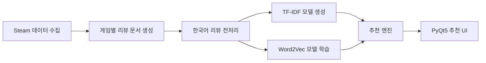

# 🎮 Steam Game Recommendation

<br>

## 📌 1. Project Summary (프로젝트 요약)

Steam Game Recommendation은 Steam에서 한국어를 지원하는 게임과 한국어 사용자 리뷰를 수집한 뒤, 사용자가 입력한 게임명 또는 연관 검색어를 바탕으로 유사한 게임을 추천하는 게임 추천 시스템입니다.

<br>

## 2. Key Features (주요 기능)

### 2.1 Steam Korean Review Crawling (Steam 한국어 리뷰 수집)
* Steam에서 한국어를 지원하는 게임 목록, 게임별 상세 정보, 장르, 태그, 카테고리, 출시 연도 수집
* Steam Review API를 이용해 한국어 리뷰 수집

### 2.2 Korean NLP Preprocessing (한국어 자연어 전처리)
* 리뷰 텍스트에서 URL, HTML 특수문자, 불필요한 기호 제거
* 게임 추천에 중요한 단어가 불용어로 제거되지 않도록 보호 단어 설정

### 2.3 TF-IDF Vectorization (문서 벡터화)
* 게임 1개를 하나의 추천용 문서로 구성
* 긍정 리뷰, 태그, 카테고리를 각각 TF-IDF 벡터로 변환
* 입력 문장과 게임 문서 간 코사인 유사도 계산

### 2.4 Word2Vec Semantic Matching (의미 기반 추천)
* 전체 리뷰, 태그, 카테고리 토큰을 기반으로 Word2Vec 모델 학습
* 게임별 평균 Word2Vec 벡터를 생성하여 게임 간 의미 유사도 계산

### 2.5 Hybrid Recommendation (혼합 추천 점수)
* "TF-IDF 유사도", "Word2Vec 유사도", "Steam 평가 점수 보정값" 세 가지를 함께 반영하여 최종 추천 점수를 계산

### 2.6 PyQt5 GUI (추천 UI)

* 좋아하는 게임 선택, 연관 검색어 입력 기반 추천
* 최대 3개 태그 필터와 최소 출시 연도 필터 적용
* 추천 개수 설정
* 추천 결과 클릭 시 상세 정보 표시
* Steam 페이지 바로가기 기능 제공

<br>

## 3. Tech Stack (기술 스택)
### 3.1 Language


<br>

### 3.2 Data Processing / AI

| 기술                | 역할                    |
| ----------------- | --------------------- |
| Pandas            | CSV 데이터 처리 및 병합       |
| NumPy             | 벡터 연산                 |
| SciPy             | Sparse Matrix 저장 및 로드 |
| scikit-learn      | TF-IDF Vectorizer     |
| Gensim            | Word2Vec 모델 학습        |
| KoNLPy Okt        | 한국어 형태소 분석            |
| Cosine Similarity | 입력 문장과 게임 간 유사도 계산    |

### 3.3 GUI / Application

| 기술               | 역할                            |
| ---------------- | ----------------------------- |
| PyQt5            | 데스크톱 추천 UI 구현                 |
| QThread          | 모델 로딩, 추천 계산, 이미지 로딩 백그라운드 처리 |
| QTableWidget     | 추천 결과 표 출력                    |
| QDesktopServices | Steam 페이지 바로가기 실행             |

---

<br>

## 4. Project Structure (프로젝트 구조)

```text
project_7_game_recommendation/
├── datasets/                                      # 수집 및 전처리된 CSV 데이터
│   ├── steam_koreana_supported_games_v2.csv       # 한국어 지원 게임 목록
│   ├── steam_games_detail_v2.csv                  # 게임 상세 정보
│   ├── steam_reviews_raw_v2.csv                   # 원본 리뷰 데이터
│   ├── steam_crawling_progress_v2.csv             # 크롤링 진행 기록
│   ├── steam_game_review_documents.csv            # 게임별 추천 문서
│   ├── steam_game_reviews_preprocessed.csv        # 전처리 완료 데이터
│   ├── steam_stopwords.csv                        # 최종 불용어 목록
│   └── steam_stopword_candidates.csv              # 불용어 후보 목록
│
├── models/                                        # 모델 학습 후 생성되는 파일
│   ├── tfidf/                                     # TF-IDF 모델 및 행렬
│   └── word2vec/                                  # Word2Vec 모델 및 게임 벡터
│
├── job01_steam_review_crawling.py                 # Steam 게임 정보 및 한국어 리뷰 수집
├── job02_make_steam_review_documents.py           # 게임 1개 = 문서 1개 형태로 변환
├── job03_preprocess_steam_reviews.py              # 리뷰 텍스트 전처리 및 불용어 처리
├── job04_build_tfidf_steam.py                     # TF-IDF 모델 생성
├── job05_train_word2vec_steam.py                  # Word2Vec 모델 학습
├── job06_recommend_steam.py                       # 추천 엔진 구현
└── job07_pyqt5_steam_recommender.py               # PyQt5 추천 UI 실행 파일
```

---

## 5. Data & AI Pipeline (데이터 처리 흐름)

### 5.1 Overall Flow



---

### 5.2 Data Source

| 데이터                  | 내용                               |
| -------------------- | -------------------------------- |
| Steam Search         | 한국어 지원 게임 목록 수집                  |
| Steam AppDetails API | 게임명, 출시일, 장르, 카테고리, 설명, 이미지 등 수집 |
| Steam Store Page     | 사용자 태그 수집                        |
| Steam Reviews API    | 한국어 리뷰, 추천 여부, 플레이타임, 투표 정보 등 수집 |

---

### 5.3 Crawling Process

| 단계 | 처리 내용                            |
| -- | -------------------------------- |
| 1  | Steam에서 한국어 지원 게임 목록 수집          |
| 2  | AppID 기준으로 게임 상세 정보 수집           |
| 3  | 게임별 한국어 리뷰 수집                    |
| 4  | 이미 수집한 리뷰 ID는 중복 저장하지 않음         |
| 5  | 진행 상태를 CSV로 저장하여 재실행 시 이어서 수집 가능 |

---

### 5.4 Review Document Generation

`job02_make_steam_review_documents.py`에서는 리뷰 단위 데이터를 게임 단위 문서로 변환합니다.

```text
리뷰 1개 = 데이터 1행
        ↓
게임 1개 = 추천 모델용 문서 1개
```

| 사용 목적      | 사용 컬럼                                |
| ---------- | ------------------------------------ |
| 모델 학습 텍스트  | 긍정 리뷰, 태그, 카테고리                      |
| UI 표시 / 필터 | 장르, 설명, 출시 연도, 무료 여부, 플랫폼            |
| 점수 보정      | 리뷰 평가 점수, 플레이타임, weighted vote score |
| 식별         | appid, game_title, review_id         |

---

### 5.5 Text Preprocessing

`job03_preprocess_steam_reviews.py`에서는 추천 모델에 사용할 텍스트를 정제합니다.

| 단계 | 처리 내용                 |
| -- | --------------------- |
| 1  | URL 제거                |
| 2  | HTML 특수문자 복원          |
| 3  | 영어 소문자 변환             |
| 4  | 한글, 영어, 숫자만 남김        |
| 5  | Okt 형태소 분석            |
| 6  | 명사, 동사, 형용사, 영어 토큰 추출 |
| 7  | 불용어 제거                |
| 8  | 너무 짧거나 의미 없는 토큰 제거    |

게임 추천에서 중요한 단어는 보호 단어로 지정하여 실수로 제거되지 않도록 했습니다.

예시 보호 단어:

```text
스토리, 그래픽, 난이도, 타격감, 공포, 멀티, 싱글,
힐링, 생존, 전투, 퍼즐, 로그라이크, 오픈월드,
좋다, 재밌다, 추천, 비추천, 갓겜, 망겜
```

---

### 5.6 TF-IDF Model

`job04_build_tfidf_steam.py`에서는 하나의 통합 텍스트만 사용하는 것이 아니라, 추천 방식별 가중치를 다르게 적용하기 위해 텍스트 source를 분리하여 TF-IDF 모델을 생성합니다.

| Source             | 의미                       |
| ------------------ | ------------------------ |
| `positive_reviews` | 긍정 리뷰 전처리 텍스트            |
| `tags`             | Steam 태그 전처리 텍스트         |
| `categories`       | Steam 카테고리 전처리 텍스트       |
| `model_text`       | 긍정 리뷰 + 태그 + 카테고리 통합 텍스트 |

---

### 5.7 Word2Vec Model

`job05_train_word2vec_steam.py`에서는 게임 리뷰와 태그, 카테고리 토큰을 이용해 Word2Vec 모델을 학습합니다.

| 항목        | 내용              |
| --------- | --------------- |
| 모델 방식     | Skip-gram       |
| 벡터 크기     | 100             |
| window    | 4               |
| min_count | 3               |
| epochs    | 50              |
| 사용 목적     | 단어 간 문맥적 유사도 반영 |

Word2Vec 모델은 하나만 학습하고, 게임별 평균 벡터는 source별로 따로 저장합니다.

```text
positive_reviews 평균 벡터
tags 평균 벡터
categories 평균 벡터
model_text 평균 벡터
```

---

## 6. Recommendation Logic (추천 방식)

### 6.1 Keyword Based Recommendation

사용자가 직접 연관 검색어를 입력하는 방식입니다.

예시 입력:

```text
스토리 좋은 로그라이크 보스전 게임
힐링 농사 낚시 게임
공포 생존 멀티 게임
```

추천 점수 계산 구조:

```text
final_score
= TF-IDF 점수
+ Word2Vec 점수
+ 리뷰 평가 보정 점수
```

| 점수 요소          | 가중치  |
| -------------- | ---- |
| TF-IDF Score   | 0.60 |
| Word2Vec Score | 0.20 |
| Review Score   | 0.20 |

---

### 6.2 Similar Game Based Recommendation

사용자가 좋아하는 게임을 선택하면, 해당 게임과 비슷한 게임을 추천합니다.

예시 입력:

```text
Hades
Stardew Valley
Terraria
```

추천 점수 계산 구조:

| 점수 요소          | 가중치  |
| -------------- | ---- |
| TF-IDF Score   | 0.45 |
| Word2Vec Score | 0.35 |
| Review Score   | 0.20 |

특정 게임 기반 추천에서는 리뷰 감상뿐 아니라 태그와 장르적 특징을 더 중요하게 반영합니다.

---

### 6.3 Recommendation Filters

| 필터        | 내용                           |
| --------- | ---------------------------- |
| 추천 개수     | 5개 ~ 30개                     |
| 최소 출시 연도  | 1980년 ~ 2026년                |
| 태그 필터     | 최대 3개까지 선택 가능                |
| 태그 조건     | 선택한 태그를 모두 포함하는 AND 조건       |
| Steam 페이지 | AppID 기반 Steam Store 페이지로 이동 |

---

## 7. User Guide (사용자 가이드)

### 7.1 실행 화면

아래 이미지는 프로젝트 실행 화면 예시입니다.

```markdown

```

---

### 7.2 추천 사용 방법

| 단계 | 설명                        |
| -- | ------------------------- |
| 1  | 프로그램 실행                   |
| 2  | 좋아하는 게임 선택 또는 연관 검색어 입력   |
| 3  | 필요한 경우 태그 필터 선택           |
| 4  | 추천 개수와 최소 출시 연도 설정        |
| 5  | 추천 실행 버튼 클릭               |
| 6  | 추천 결과 표에서 게임 선택           |
| 7  | 상세 정보 확인 또는 Steam 페이지로 이동 |

---

### 7.3 Result Table

추천 결과 표에는 핵심 정보만 표시합니다.

| 표시 항목 | 설명                |
| ----- | ----------------- |
| appid | Steam 게임 고유 ID    |
| 게임명   | 추천된 게임 이름         |
| 출시 연도 | 게임 출시 연도          |
| 장르    | Steam 장르 정보       |
| 무료 여부 | 무료 / 유료           |
| 연령 제한 | 전체 이용 가능 또는 연령 제한 |
| 추천 점수 | 최종 계산된 추천 점수      |

---

### 7.4 Detail Area

추천 결과에서 게임을 클릭하면 상세 정보가 표시됩니다.

| 상세 정보        | 내용                         |
| ------------ | -------------------------- |
| Header Image | Steam 게임 대표 이미지            |
| 점수           | TF-IDF, Word2Vec, 평가 보정 점수 |
| 태그           | Steam 사용자 태그               |
| 카테고리         | 싱글플레이, 멀티플레이 등             |
| 플랫폼          | Windows, Mac, Linux 지원 여부  |
| 설명           | Steam short description    |
| 바로가기         | Steam Store 페이지 이동         |

---

## 8. Run (실행 방법)

### 8.1 Install Packages

```bash
pip install pandas numpy scipy scikit-learn gensim konlpy PyQt5 requests
```

KoNLPy Okt를 사용하기 때문에 Java가 필요합니다.

```bash
sudo apt install openjdk-17-jdk
```

---

### 8.2 Run Data Pipeline

처음부터 전체 데이터를 다시 만들 경우 아래 순서대로 실행합니다.

```bash
python job01_steam_review_crawling.py
python job02_make_steam_review_documents.py
python job03_preprocess_steam_reviews.py
python job04_build_tfidf_steam.py
python job05_train_word2vec_steam.py
```

각 단계에서 생성된 CSV와 모델 파일은 `datasets/`, `models/` 폴더에 저장됩니다.

---

### 8.3 Run Recommendation UI

모델 파일이 생성된 후 PyQt5 UI를 실행합니다.

```bash
python job07_pyqt5_steam_recommender.py
```

---

## 9. Result (결과)

### 9.1 Main UI

```markdown

```

### 9.2 Game Recommendation Result

```markdown

```

### 9.3 Game Detail View

```markdown

```

---

## 10. Troubleshooting (문제 해결 기록)

### 10.1 Steam Review Crawling Request Limit

**Issue (문제 상황)**

* Steam 리뷰를 여러 게임에 대해 반복적으로 요청하는 과정에서 요청 실패 또는 응답 지연이 발생할 수 있음
* 동일한 게임을 다시 수집할 때 중복 리뷰가 저장될 가능성이 있음

**Analysis (원인 분석)**

* 외부 API를 반복 호출하기 때문에 네트워크 상태와 요청 빈도에 영향을 받음
* 중간에 프로그램이 종료되면 어디까지 수집했는지 추적하기 어려움

**Action (해결 방법)**

* 요청 실패 시 재시도 로직 추가
* 요청 간 대기 시간 설정
* 수집 진행 상태를 `steam_crawling_progress_v2.csv`에 저장
* 이미 저장된 `review_id`는 다시 저장하지 않도록 중복 제거

**Result (결과)**

* 중단 후 재실행해도 기존 수집 데이터를 이어서 사용할 수 있음
* 중복 리뷰 저장 문제를 줄이고 수집 안정성을 높임

---

### 10.2 Stopword Selection Error

**Issue (문제 상황)**

* 빈도만 기준으로 불용어를 제거하면 게임 추천에 중요한 단어까지 삭제될 수 있음
* 예를 들어 `스토리`, `공포`, `멀티`, `로그라이크`, `추천`, `비추천` 같은 단어는 자주 등장하지만 추천 품질에 중요한 단어임

**Analysis (원인 분석)**

* 많이 등장하는 단어가 항상 불필요한 단어는 아님
* 게임 리뷰에서는 장르, 플레이 방식, 감성 평가 단어가 추천 기준이 될 수 있음

**Action (해결 방법)**

* 불용어 후보 파일을 자동 생성하되, 자동 제거하지 않도록 구성
* 중요한 단어는 보호 단어로 지정
* 보호 단어가 불용어 목록에 들어가면 코드가 중단되도록 처리

**Result (결과)**

* 추천에 중요한 단어가 실수로 제거되는 문제를 방지함
* 전처리 결과의 신뢰성을 높임

---

### 10.3 Java Heap Memory Error

**Issue (문제 상황)**

* 게임별 리뷰를 하나의 긴 문서로 합친 뒤 Okt 형태소 분석을 수행하면 Java heap memory 오류가 발생할 수 있음

**Analysis (원인 분석)**

* KoNLPy Okt는 내부적으로 Java를 사용함
* 매우 긴 문자열을 한 번에 분석하면 메모리 사용량이 커짐

**Action (해결 방법)**

* `JAVA_TOOL_OPTIONS`를 설정하여 Java 메모리 크기 증가
* 긴 텍스트를 일정 길이의 chunk로 나누어 형태소 분석 수행

**Result (결과)**

* 긴 리뷰 문서도 안정적으로 전처리 가능
* 대량 리뷰 데이터 처리 중 메모리 오류를 줄임

---

### 10.4 TF-IDF / Word2Vec Row Alignment

**Issue (문제 상황)**

* TF-IDF 행렬과 Word2Vec 벡터의 row 순서가 어긋나면 추천 결과가 다른 게임으로 표시될 수 있음

**Analysis (원인 분석)**

* TF-IDF와 Word2Vec은 서로 다른 파일로 저장됨
* 중간에 빈 텍스트 행이 제거되면 row 순서가 달라질 가능성이 있음

**Action (해결 방법)**

* `appid`를 기준으로 TF-IDF index와 Word2Vec index를 다시 정렬
* 공통으로 존재하는 게임만 추천 후보로 사용

**Result (결과)**

* 추천 점수와 게임 정보가 같은 게임을 가리키도록 안정화
* 추천 결과 오류 가능성을 줄임

---

### 10.5 PyQt5 Image Loading Issue

**Issue (문제 상황)**

* 일부 Ubuntu/PyQt 환경에서 Steam header image가 정상적으로 로드되지 않는 문제가 발생함

**Analysis (원인 분석)**

* Qt의 네트워크 이미지 로딩 방식이 HTTPS 이미지 요청에서 불안정할 수 있음

**Action (해결 방법)**

* `QNetworkAccessManager` 대신 `urllib.request` 기반 이미지 다운로드 방식 사용
* 이미지 로딩을 별도 `QThread`에서 처리하여 UI 멈춤 방지

**Result (결과)**

* Steam 게임 대표 이미지 표시 안정성 개선
* 추천 UI 사용 중 멈춤 현상 감소

---

## 11. Future Improvements (개선 방향)

* 사용자 클릭 로그를 저장하여 추천 품질 평가
* Steam 페이지 바로가기 클릭률 기반 사용자 선택률 분석
* 장르, 태그, 리뷰 감성 점수 가중치 자동 조정
* 한글 별칭 사전 확장
* 추천 이유를 자연어 문장으로 설명하는 기능 추가
* 게임 수와 리뷰 수를 더 확장하여 추천 다양성 개선
* Precision@K, Recall@K 같은 정량 평가 지표 추가
